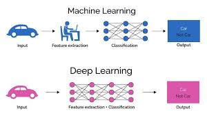

## Deep Learning
1. traditional machine learning has weaknesses with graphs and text
2. Deep Learning 
    - CNN(Convolutional Neural Network) -graphs 
        - Convolutional Layer
        - Pooling Layer
        - Fully Connected Layer
    - RNN(Recurrent Neural Network) -text
        - Embedding Layer
        - Recurrent Neural Network Layer
        - Fully Connected Layer
    - ANN(Artificial Neural Network)
        - Input Layer
        - Hidden Layer
        - Output Layer
3. Tensor
- Pytorch 

### What is deep learning?
1. Artificial Intelligence 
- Machine Learning
    - load data
    - eda
    - preprocessing
    - feature engineering (*important): must design features manually
    - model training
    - model eval
- Deep Learning
    - feature engineering: models learn representations directly from raw data: 
    input layer -> hidden layer -> output layer
    - neuron: weighted sum, activation function
    - “black box”
    - tensor: high dimension

