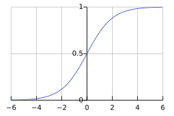

## Logistics Regression
- Binary Classification 
    - Whether a person has a disease (Yes / No)
    - Whether an email is spam (Spam / Not Spam)
    - Whether a customer will buy a product (Buy / Not Buy)
    - Whether a credit card will default (Default / No Default)
- Sigmoid function
$f(x) = \frac{1}{1 + e^{-x}}$
takes any real number from $−∞$ to $+∞$ and maps it into the range (0, 1).

- Principle: The value processed by linear regression is mapped to the range (0, 1) through the sigmoid activation function, and a threshold is used to divide the samples into positive and negative classes.
- Maximum Likelihood Estimation, MLE
Talk more in WorkSpace -> Jupyter Notebook